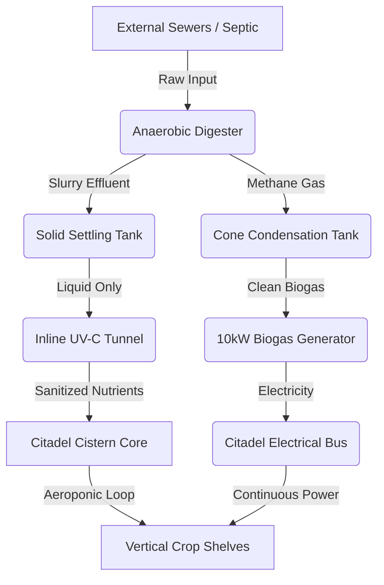

some specs are staying others are located in REVISION 1

II. Technical Specifications
​Geometry: 40ft Diameter Octagon / 15ft Depth (10ft sub-grade).
​Shell: 3D-Printed NNF-Doped Geopolymer (Seismic Grade).
​Roof: Concave ETFE Tension Membrane (Parabolic Light-Funnel).
​Infrastructure: 8 Vertical "Vascular" Pillars for aeroponic growth and structural water delivery.
​Metabolism: Anaerobic Digester (Waste-to-Stock) + Mycoremediation Filter.
​III. Autonomous Reflex Systems
​Irrigation: Zero-pump Capillary Wick System.
​Climate: Venturi-Effect air entrainment (Passive mold/heat control).
​Defense: Infrasonic pest deterrents and "Guardian Niche" predatory insect habitats.
​Security: Spectroscopic chemical detection and Fiber-Optic forensic imaging for ecological protection.
​IV. Black Swan Resilience
​Flooding: Passive Hydrostatic Ballast (The building cannot float out of the ground).
​Seismic: NNF Hardening (Liquid to Solid transformation during impact).
​Grid Failure: Geothermal 55°F thermal mass + TEG-powered UV-C sterilization.
​V. Call for Contributors
​We are looking for Systems Engineers, Mycologists, and CAD Designers to refine the following "Skeletons":
​Vascular Pillar Toolpathing: Optimizing the 3D-print for maximum aeroponic surface area.
​Sovereign OS Chemical Library: Expanding the spectroscopic database for forensic detection.
​Woven Polymer Stress Analysis: Engineering the ETFE basalt-mesh for 100-year snow loads.
---

## 🏛️ Commercial Inquiries & Strategic Partnerships

While this repository is licensed under the **GNU GPL v3.0** to ensure the free dissemination of knowledge and technical resilience, we recognize the specific requirements of enterprise-scale aviation, logistics, and infrastructure.

**Project Kinetic offers a Dual-Licensing Pathway:**
* **Sovereign Path (GPL v3.0):** Ideal for open-source development, academic research, and community resilience.
* **Enterprise Path (Custom):** For organizations requiring proprietary integration, specialized indemnification, or "Clean-Room" implementation without the "copyleft" requirements of the GPL.

**We are currently seeking partners for:**
1.  **Ground-Fleet Pilot Programs:** Proving "Kinetic Skin" and "Cryo-Cage" tech on non-flight logistics vehicles.
2.  **Aviation Technical Audits:** Facilitating "Sovereign-to-Systems" handshakes for fleet modernization.
3.  **Collaborative R&D:** Customizing the Basalt-Polymer logic for specific airframe requirements.

**Direct Inquiry:** [pkinetic4@gmail.com](mailto:pkinetic4@gmail.com)
*Subject Line: Commercial Partnership Inquiry - project Kinetic 

---

