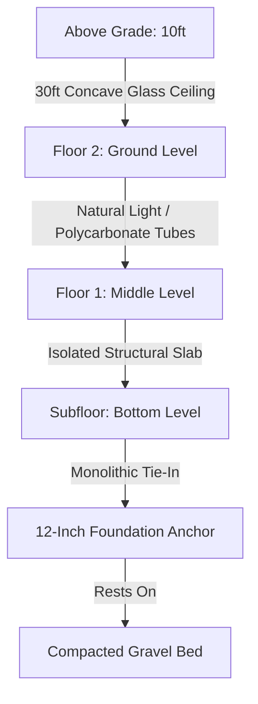
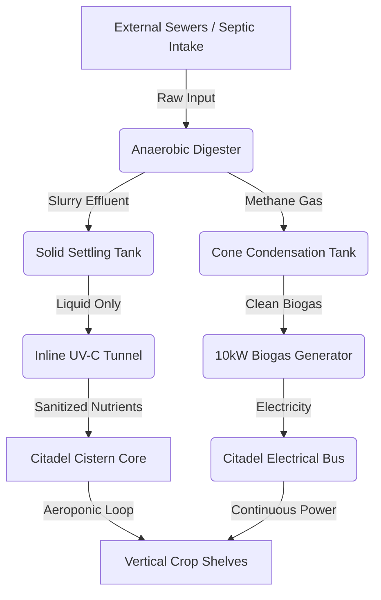
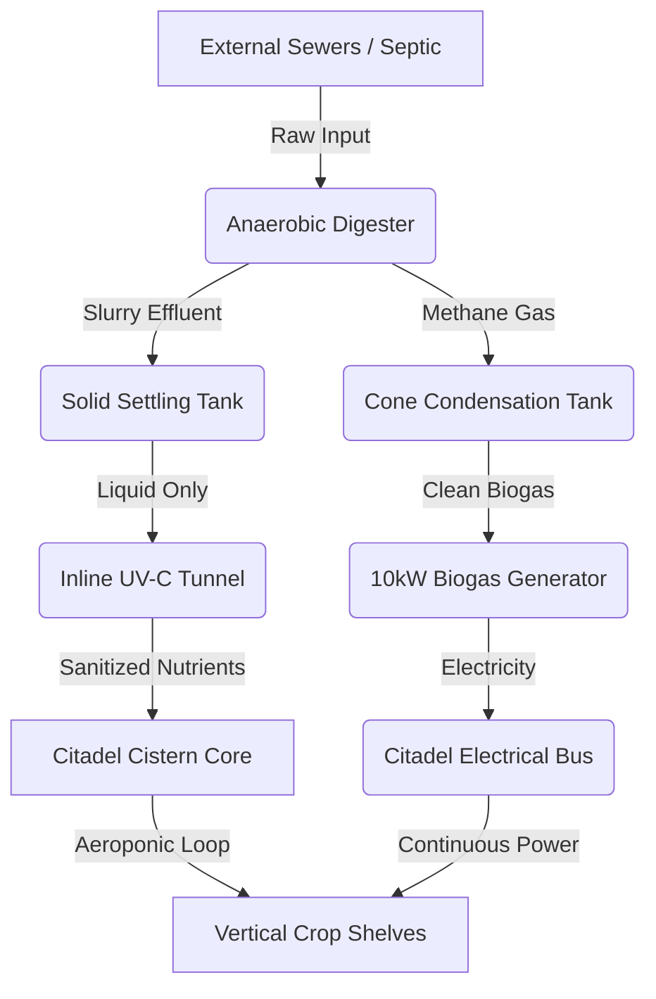

some specs are staying others are located in REVISION 1
# Project Kinetic: Sovereign-Hearth (Biosphere Vault)

## System Revision 2.0 (Integrated External Waste & Hybrid Energy Node)

An open-source, self-sustaining, closed-loop food production and decentralized infrastructure system designed for 100-year operational resilience. This earth-sheltered subterranean architecture utilizes passive physics, hybrid renewable microgrids, and biosecure nutrient cycling to provide primary caloric support for 40–80 people or supplemental nutrition for 100–200 urban residents without reliance on commercial utility grids.

---

## 1. Spatial & Structural Architecture

*   **Physical Profile:** Monolithic cylindrical, earth-sheltered subterranean layout.
*   **Core Dimensions:** 30 ft Exterior Diameter, 30 ft Total Height.
*   **Subterranean Depth:** 20 ft underground (67% total structure mass) to maximize thermal mass insulation and earth sheltering.
*   **Structural Walls:** 10–14 inch reinforced concrete walls calculated to resist lateral earth pressures and subterranean hydrostatic loading.
*   **Foundation Anchor:** 12-inch reinforced concrete floor slab tied monolithically to the structural walls. This design acts as a heavy anchor, preventing buoyant lifting or structural shifting in areas with high water tables or saturated soil conditions.
*   **Internal Floor Slabs:** 12-inch thick reinforced concrete spans, structurally reinforced and split by vertical load-bearing columns.
*   **Productive Space Allocation:** 3,220 total square feet of active growing surface area distributed vertically.
    *   **Floor 2 (Top/Ground Level):** 10ft vertical clearance. Maximizes natural light diffusion via a 30ft concave glass/polycarbonate ceiling dome and 8–12 vertical clear polycarbonate structural tubes.
    *   **Floor 1 (Middle Level):** 10ft vertical clearance. Houses 752 sq ft of lit wall shelving (utilizing a 94ft circumference $\times$ 2ft deep array stacked across 4 vertical tiers) and 564 sq ft of dark zones for fungal/worm cultivation. Requires artificial LED illumination arrays.
    *   **Subfloor (Bottom Level):** 400 sq ft pristine clean zone dedicated exclusively to seed germination, seedling starting, and clean vermicomposting. Completely isolated from external waste processing lines to eliminate mold and cross-contamination risks.

---

## 2. Closed-Loop Hydrological System

*   **Primary Catchment:** 700 sq ft concave rainwater harvesting surface integrated directly into the roof dome structure.
*   **Annual Collection Yield:** ~15,708 gallons (calculated based on a regional baseline of 36 inches of annual rainfall).
*   **Irrigation Efficiency:** 95% efficient aeroponic recirculation loops. Plant transpiration and evaporation account for a strict net annual water loss of only 8,300 gallons.
*   **Active Misting Capacity:** The closed loop safely recycles water to deliver approximately 455 gallons of active nutrient mist per day across the 3,220 sq ft growing footprint (~0.14 gallons/sq ft/day).
*   **Stabilization Cistern:** 20,000-gallon internal water storage reservoir. The system is filled completely to capacity during initial commissioning to establish immediate liquid thermal mass and instant operating loops.
*   **Drought Buffer:** Holds a net annual rainwater surplus of ~7,000–7,450 gallons, exceeding the 60-day absolute drought safety window for the resident community.

---

## 3. Hybrid Power & Lighting Infrastructure

*   **Thermal Regulation:** Passive geothermal earth-sheltering holds a baseline internal environment of 55°F year-round. Ground-source heat pumps provide active climate micro-adjustments for tropical or sensitive crop arrays.
*   **Electrical Demand Constraints:** Subterranean LED grow lights demand a continuous 30 Kilowatt (kW) electrical draw. To maintain a strict energy balance without grid dependence, the system utilizes a standardized **12-hour photoperiod**, capping daily consumption at **360 kWh**.
*   **Power Solution A (Solar Array):** A 45 kW DC surface-mounted solar array consisting of approximately 113 commercial 400W panels. Requires a 2,500 sq ft footprint near the installation site, yielding ~162 kWh/day (calculated at 4.5 peak sun hours).
*   **Power Solution B (Biogas Engine):** A 10 kW continuous-duty biogas generator engine providing baseline nighttime power and charging capabilities, yielding 240 kWh/day.
*   **Microgrid Energy Balance:** Total daily generation (162 kWh Solar + 240 kWh Biogas = 402 kWh) safely offsets the 360 kWh lighting demand, routing a **42 kWh daily electrical surplus** to the central battery bank for auxiliary pumps, automation systems, and UV-C sanitization.

## 4. External Biosecurity Node & Nutrient Loop

To protect the internal agricultural core from pathogenetic cross-contamination, airborne bacteria, and toxic gas accumulation, all primary waste processing is entirely isolated to an external facility.

1.  **Input Feed:** Connects directly into external municipal neighborhood sewer networks or localized septic tank arrays.
2.  **Gas Extraction Loop:** Raw biogas is funneled through an exterior condensation trap and water-cone filter to remove moisture and sulfur compounds, yielding clean methane to fuel the 10 kW generator or compress into storage tanks.
3.  **Liquid Nutrient Pathway:** 
    *   Digester slurry enters an external **Solid Settling Tank** to precipitate heavy organic particulates.
    *   The remaining liquid passes into a custom **Inline UV-C Sanitization Tunnel**.
    *   Pathogen-free, nutrient-rich liquid is safely pumped into the internal cistern network to feed the aeroponic crop bays.

---

## 5. Non-Thermal UV-C Sanitization Detail

*   **Objective:** Achieve complete destruction of food-borne pathogens (e.g., *E. coli*) within the liquid fertilizer without heating the solution or altering vital organic macro/micronutrient profiles.
*   **Core Core Component:** A 5-foot flow section constructed of high-purity clear quartz glass (fused silica) ensuring 90%+ UV-C light wave transmission directly into the passing fluid.
*   **Fluid Dynamics Optimization:** Includes internal static mixing baffles to force the turbid liquid fertilizer into a thin-film flow pattern (< 1/4 inch thick) directly against the quartz wall, eliminating "particulate shadowing" where pathogens can hide.
*   **Radiation Housing:** A sealed, highly reflective aluminum cylinder lining the quartz core, equipped with an internal 254nm wavelength UV-C LED strip array delivering a continuous 360-degree pathogen-kill dosage exceeding 40 mJ/cm².
*   **Biosecurity Pest Restrictions:** Environmental airlocks utilize a mechanical two-door vestibule configuration. Misting systems inside structural airlocks must strictly use pure water or pressurized air curtains instead of essential oils to prevent killing beneficial colony insects (e.g., predatory wasps, ladybugs, lacewings) deployed for pest management.

---

## 6. Open Hardware Licensing & Legal Prior Art

All schematics, mathematical frameworks, layouts, and physics calculations contained in this repository are permanently published as **open-source prior art**. 

This engineering data is distributed under the **CERN Open Hardware Licence - Strongly Reciprocal (CERN-OHL-S v2.0)**. 

### What This Means for Users and Developers:
*   **Community Freedom:** Any individual, community, cooperative, or non-profit organization is legally free to download, study, modify, and physically manufacture this infrastructure without paying licensing fees or royalties.
*   **Anti-Corporate/Anti-Monopoly Protection:** If any corporate entity or commercial manufacturer modifies these blueprints or builds products based on these designs, the CERN-OHL-S license legally forces them to make their complete physical manufacturing files, CAD drawings, adjustments, and source code completely public to the world under the same exact open terms. Commercial patenting of this exact framework or its direct derivatives is legally blocked by this cryptographically timestamped public record.

---

## 7. Professional Consulting & Custom Implementations

While these blueprints are entirely free to the public to encourage global decentralized infrastructure, successfully adapting these frameworks to specific local geographies requires precision engineering adjustments. 

If your eco-village, intentional community, agricultural cooperative, NGO, or progressive municipal district requires specialized design adaptation, please contact the lead architect for professional consulting services:

*   **Site-Specific Structural Calculations:** Engineering custom reinforced concrete wall thickness and slab loading parameters based on local soil density, regional water tables, and seismic activity.
*   **Climate & Latitude Optimization:** Recalculating concave roof angles, solar array tracking layouts, solar panel configurations, and ground-source heat pump sizing for extreme northern, tropical, or arid environments.
*   **Microgrid Electrical Engineering:** Designing and scaling custom battery banks, automated transfer switches, and biogas generator throttling systems tailored to your community’s specific consumption

*   below is first draft

II. Technical Specifications
​Geometry: 40ft Diameter Octagon / 15ft Depth (10ft sub-grade).
​Shell: 3D-Printed NNF-Doped Geopolymer (Seismic Grade).
​Roof: Concave ETFE Tension Membrane (Parabolic Light-Funnel).
​Infrastructure: 8 Vertical "Vascular" Pillars for aeroponic growth and structural water delivery.
​Metabolism: Anaerobic Digester (Waste-to-Stock) + Mycoremediation Filter.
​III. Autonomous Reflex Systems
​Irrigation: Zero-pump Capillary Wick System.
​Climate: Venturi-Effect air entrainment (Passive mold/heat control).
​Defense: Infrasonic pest deterrents and "Guardian Niche" predatory insect habitats.
​Security: Spectroscopic chemical detection and Fiber-Optic forensic imaging for ecological protection.
​IV. Black Swan Resilience
​Flooding: Passive Hydrostatic Ballast (The building cannot float out of the ground).
​Seismic: NNF Hardening (Liquid to Solid transformation during impact).
​Grid Failure: Geothermal 55°F thermal mass + TEG-powered UV-C sterilization.
​V. Call for Contributors
​We are looking for Systems Engineers, Mycologists, and CAD Designers to refine the following "Skeletons":
​Vascular Pillar Toolpathing: Optimizing the 3D-print for maximum aeroponic surface area.
​Sovereign OS Chemical Library: Expanding the spectroscopic database for forensic detection.
​Woven Polymer Stress Analysis: Engineering the ETFE basalt-mesh for 100-year snow loads.
---

## 🏛️ Commercial Inquiries & Strategic Partnerships

While this repository is licensed under the **GNU GPL v3.0** to ensure the free dissemination of knowledge and technical resilience, we recognize the specific requirements of enterprise-scale aviation, logistics, and infrastructure.

**Project Kinetic offers a Dual-Licensing Pathway:**
* **Sovereign Path (GPL v3.0):** Ideal for open-source development, academic research, and community resilience.
* **Enterprise Path (Custom):** For organizations requiring proprietary integration, specialized indemnification, or "Clean-Room" implementation without the "copyleft" requirements of the GPL.

**We are currently seeking partners for:**
1.  **Ground-Fleet Pilot Programs:** Proving "Kinetic Skin" and "Cryo-Cage" tech on non-flight logistics vehicles.
2.  **Aviation Technical Audits:** Facilitating "Sovereign-to-Systems" handshakes for fleet modernization.
3.  **Collaborative R&D:** Customizing the Basalt-Polymer logic for specific airframe requirements.

**Direct Inquiry:** [pkinetic4@gmail.com](mailto:pkinetic4@gmail.com)
*Subject Line: Commercial Partnership Inquiry - project Kinetic 

---

